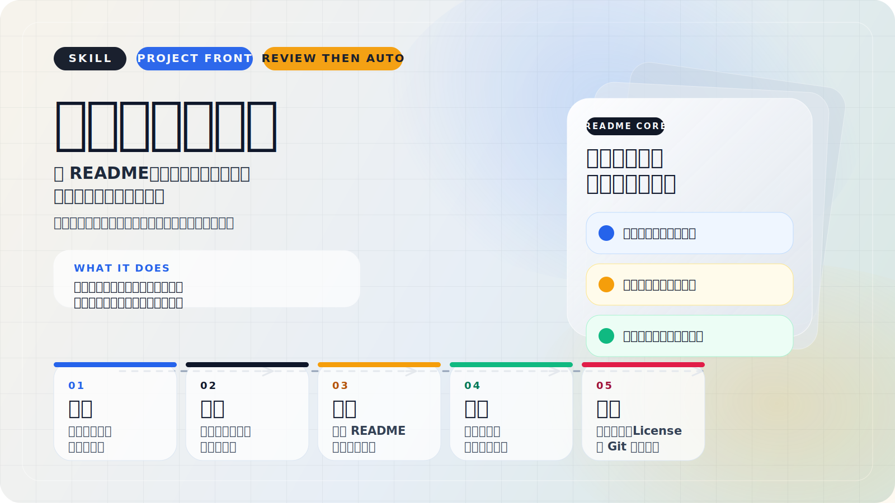

<p align="center">
  
</p>

# 项目门面生成器

[](#适用对象)
[](#它能帮你做什么)
[](#执行模式)
[](../../LICENSE)

把项目整理到“能见人、能介绍、能移交”的状态。

它会先调查当前仓库状态，判断仓库形态、README 层级和项目类型，再以 `README` 为核心整理项目门面；进入发布档位时，再按条件补视觉素材、同步 `LICENSE`，并在边界清晰时做 Git 收尾。

> 首屏视觉已启用：当前使用 SVG 横幅，把 `调查 -> 定位 -> 生成 -> 评测 -> 收尾` 这条工作链直接放到第一页。

## 它能帮你做什么

- 重做或重构 README，让首页先回答“这是什么、对谁有用、怎么开始”
- 补齐安装、使用、示例、截图、License 说明等常见遗漏
- 识别当前任务到底是仓库根 README、子项目 README，还是单个 skill README
- 在正式发布档位下，按条件检查 SVG 标题、横幅或首屏视觉素材
- 在授权和改动边界都清晰时，继续处理 `LICENSE / Git`

如果要把 SVG 这一步也直接接上，最稳的说法是：

```text
用项目门面生成器按正式发布整理这个项目。
如果需要 SVG 标题或横幅，
默认调用 $svg-assembly-animator 继续处理组装动画和透明序列帧导出。
```

## 适用对象

- 独立开发者：项目做完了，但仓库门面还像草稿
- AI 编程用户：代码已经跑起来了，需要 AI 帮你补齐交付材料
- 开源作者：想把仓库整理到可以直接发链接的状态
- skill / 工具 / 小产品作者：需要一个能介绍、能安装、能快速上手的首页
- 阶段性交付场景：每完成一个模块，就快速补出一份能看的 README

## 它不替你决定什么

- 产品定位还没想清楚时，它不会替你拍板
- 授权策略会明显影响结果时，它不会擅自写死许可证
- 工作区里混着大量无关改动时，它不会直接自动提交
- 你需要的是完整品牌设计、营销页面或复杂插画时，它不会假装自己已经做完视觉工作

## 安装

### 方式 1：命令安装

```bash
npx skills add AdgaiWalker/Walker-skills-test --skill project-front-generator
```

### 方式 2：让 AI 帮你安装

```text
帮我安装这个 skill：
https://github.com/AdgaiWalker/Walker-skills-test

skill 名称：project-front-generator

请帮我用合适的方式完成安装。
如果支持命令安装，优先使用：
npx skills add AdgaiWalker/Walker-skills-test --skill project-front-generator

安装完成后，告诉我最短怎么调用它。
```

## 触发词

- 生成 README
- 写 README
- 美化 README
- 优化 README
- 整理项目门面
- 生成项目介绍
- 准备发布材料

## 最短调用

### 只重做 README

```text
用项目门面生成器重做这个目录的 README。
```

### 把项目整理到能发给别人看

```text
用项目门面生成器把这个项目整理到能发给别人看的状态。
```

### 按正式发布推进

```text
用 $project-front-generator 按正式发布整理这个项目。
```

如果你的代理不支持显式 skill 调用，直接把 [skill.md](skill.md) 交给 AI，再补一句这次的目标即可。

## 执行模式

这个 skill 默认不是“立刻改文件”，而是先调查再推进。

- `审核后自动`：默认推荐。先给建议卡，你确认一次，后面自动串行推进
- `自动流`：README 档位、License 策略和推送策略都已明确时直接执行
- `手动流`：每个关键阶段都停下来等你确认

通常默认推荐的是 `审核后自动`，因为它比“直接写”更稳，也比“每一步都问”更省事。

## 它会怎么工作

1. 调查当前仓库状态，确认上下文是否足够。
2. 判断这次任务是根 README、子项目 README，还是单个 skill README。
3. 判断项目更像 Skill / 工具 / 小产品，还是知识 / 教程，还是工程 / 开源项目。
4. 生成或重构 README。
5. 先做一次 README 评测，只给出 `绿色 / 黄色 / 红色` 三种结果。
6. 只有 README 通过后，才继续检查视觉门面、`LICENSE` 和 Git 收尾。
7. 只有当远程、上游分支和提交边界都清晰时，才继续自动推送。

## README 评测标准

这份 README 不是“写完就算完成”，而是先过审再放行。

评测重点只有几件事：

- 第一屏有没有先回答读者最关心的问题
- 仓库层级和项目类型有没有写对
- 安装、使用、示例是不是能直接拿来用
- 有没有明显遗漏、冲突或过度承诺
- 如果目标是正式发布，视觉门面策略是不是说清楚了

评测结果：

- `绿色`：通过，继续后续流程
- `黄色`：方向对，但要先自动修一轮再复评
- `红色`：方向不对、信息不足或风险过高，先停下来确认

## 它会在哪些情况停下来

- README 评测为 `红色`
- 许可证缺失，而且授权策略会明显影响结果
- 仓库远程不明确，或者当前分支没有清晰上游
- 工作区里混着与本次门面整理无关的改动
- 你主动要求切回手动流

## 结果单会交付什么

最少会给你一张结果单，而不是一句“已经处理完了”：

- README：已完成 / 未完成 / 需复评
- 视觉门面：未启用 / 已复用 / 已新增 / 待后续
- 视觉素材入库状态：已入库 / 已生成待入库 / 仅临时草稿
- LICENSE：沿用 / 新增 / 未处理
- Git：未处理 / 已提交 / 已推送
- 当前停止点：为什么停在这里

如果你走的是正式发布档位，交付目标就不只是一份 README，而是一套可以继续往外发的门面材料。

## 相关文档

- [README框架总纲](README框架总纲.md)
- [交接字段协议](交接字段协议.md)
- [各产物评测标准](各产物评测标准.md)
- [发布包定义](发布包定义.md)
- [平台扩展框架](平台扩展框架.md)
- [风格卡](风格卡.md)
- [案例库](案例库.md)

## 参考与来源

- [Ferry](https://github.com/AdgaiWalker/Ferry)：这套“先调查、再生成、再评测、再收尾”的方法意识来源之一

## License

`Skills-Walker` 仓库当前采用 [MIT License](../../LICENSE)。
